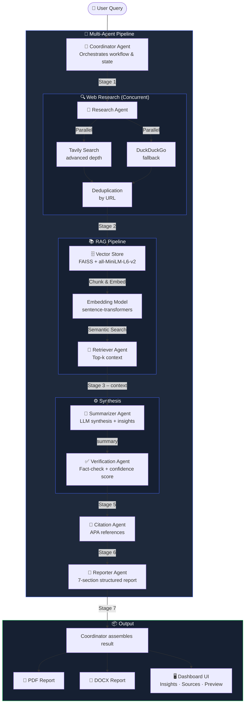

# 🔬 AI-Powered Multi-Agent Research System

<div align="center">


**A production-ready, modular AI research system where five specialized agents collaborate to deliver deep research, fact-checked reports, and downloadable PDFs — from a single query.**

[Features](#-key-features) · [Architecture](#-architecture) · [Setup](#-installation) · [API](#-api-reference) · [Usage](#-usage)

</div>

---

## 🔗 Quick Links

> All links you need — bookmarked in one place.

### 📁 Repository & Code
| Resource | Link |
|---|---|
| **GitHub Repository** | [github.com/bhardwajdevishika-sys/multi-agent-research-system](https://github.com/bhardwajdevishika-sys/multi-agent-research-system) |
| **Source Code (main branch)** | [github.com/…/tree/main](https://github.com/bhardwajdevishika-sys/multi-agent-research-system/tree/main) |
| **Clone URL (HTTPS)** | `https://github.com/bhardwajdevishika-sys/multi-agent-research-system.git` |
| **Download ZIP** | [github.com/…/archive/main.zip](https://github.com/bhardwajdevishika-sys/multi-agent-research-system/archive/refs/heads/main.zip) |

### 🔑 API Keys (get / manage)
| Service | Purpose | Link |
|---|---|---|
| **HuggingFace Token** | LLM inference (required) | [huggingface.co/settings/tokens](https://huggingface.co/settings/tokens) |
| **Tavily API Key** | Advanced web search (optional) | [app.tavily.com](https://app.tavily.com) |

### 🌐 Local App (when running)
| Page | URL |
|---|---|
| **Landing Page** | [http://localhost:5000](http://localhost:5000) |
| **Research Dashboard** | [http://localhost:5000/dashboard](http://localhost:5000/dashboard) |
| **Health Check** | [http://localhost:5000/health](http://localhost:5000/health) |
| **API — Start Research** | `POST http://localhost:5000/api/research` |
| **API — Live Status** | [http://localhost:5000/api/status](http://localhost:5000/api/status) |
| **API — Get Result** | [http://localhost:5000/api/result](http://localhost:5000/api/result) |
| **Download PDF Report** | [http://localhost:5000/api/report?format=pdf](http://localhost:5000/api/report?format=pdf) |
| **Download DOCX Report** | [http://localhost:5000/api/report?format=docx](http://localhost:5000/api/report?format=docx) |

### 📚 Docs & References
| Resource | Link |
|---|---|
| **Flask Docs** | [flask.palletsprojects.com](https://flask.palletsprojects.com) |
| **LangChain Docs** | [python.langchain.com](https://python.langchain.com) |
| **HuggingFace Inference API** | [huggingface.co/docs/api-inference](https://huggingface.co/docs/api-inference/index) |
| **FAISS Docs** | [faiss.ai](https://faiss.ai) |
| **Tavily Docs** | [docs.tavily.com](https://docs.tavily.com) |
| **sentence-transformers Docs** | [sbert.net](https://www.sbert.net) |

---

## 🧠 What It Does

Paste a research topic. Within minutes you get a fully structured academic report — complete with an abstract, key findings, methodology analysis, citations, and a downloadable PDF or DOCX.

Under the hood, five AI agents divide the work:

| Agent | Role |
|---|---|
| **Coordinator** | Orchestrates the pipeline end-to-end; manages state and progress |
| **Research Agent** | Runs parallel web searches via Tavily + DuckDuckGo |
| **Retriever Agent** | Performs semantic retrieval over a FAISS vector store |
| **Summarizer Agent** | Synthesises findings into structured, citation-linked prose |
| **Verification Agent** | Fact-checks the summary and scores confidence (0–100%) |
| **Citation Agent** | Generates APA-formatted references from real source metadata |
| **Reporter Agent** | Assembles everything into a 7-section academic report |

---

## ✨ Key Features

- **Multi-Agent Orchestration** — Coordinator delegates to specialized agents, each with isolated responsibilities and independent error handling. A failing stage degrades gracefully without crashing the pipeline.
- **Hybrid RAG Pipeline** — Web sources are chunked, embedded with `sentence-transformers/all-MiniLM-L6-v2`, and stored in an in-memory FAISS index. Semantic search retrieves the most relevant context before LLM synthesis.
- **Concurrent Web Search** — Tavily and DuckDuckGo are queried in parallel via `ThreadPoolExecutor`, cutting search latency roughly in half. Automatic deduplication by URL is applied before ingestion.
- **HuggingFace Inference API** — All LLM calls are remote (no local GPU needed). A three-model fallback chain (`Mixtral-8x7B → Llama-3-8B → Gemma-2-9B`) ensures availability.
- **Automated Report Generation** — Produces structured PDF and DOCX reports with sections: Abstract, Introduction, Key Findings, Methodology, Challenges, Future Directions, and Conclusion.
- **Real-Time Dashboard** — A dark-mode Bootstrap 5 UI polls `/api/status` every 3 seconds and shows live agent state, a progress bar, and a pipeline timeline.
- **Research Cache** — MD5-keyed JSON cache eliminates redundant LLM calls for repeated queries.
- **Thread-Safe API** — A `threading.Lock` guards all shared state; concurrent requests return a clear `409 Conflict` response.

---

## 🏗 Architecture

### Data Flow



### Project Structure

```
multi-research-agent/
├── app.py                          # Flask app factory + frontend routes
├── requirements.txt                # Pinned Python dependencies
├── .env.example                    # Environment variable template
│
├── backend/
│   ├── agents/
│   │   ├── coordinator.py          # Pipeline orchestrator (entry point)
│   │   ├── researcher.py           # Web search + source validation
│   │   ├── retriever_agent.py      # RAG context fetcher
│   │   ├── summarizer.py           # LLM summarisation + insight extraction
│   │   ├── verifier.py             # Fact-checking + confidence scoring
│   │   ├── citation_agent.py       # APA / IEEE / MLA citation formatter
│   │   └── reporter.py             # 7-section report assembly
│   │
│   ├── rag/
│   │   ├── vector_store.py         # FAISS index (add, search, save, load)
│   │   ├── chunker.py              # LangChain RecursiveCharacterTextSplitter
│   │   ├── retriever.py            # RAG retrieval + context string builder
│   │   ├── document_loader.py      # PDF / web document loader
│   │   └── reranker.py             # Optional cross-encoder reranking
│   │
│   ├── models/
│   │   ├── llm_loader.py           # HuggingFace InferenceClient + fallback chain
│   │   └── embedding_model.py      # sentence-transformers embedding wrapper
│   │
│   ├── services/
│   │   ├── web_search.py           # Tavily + DuckDuckGo (concurrent)
│   │   ├── cache_service.py        # MD5-keyed JSON result cache
│   │   ├── pdf_service.py          # PDF upload handler
│   │   └── report_service.py       # ReportLab PDF + python-docx generator
│   │
│   ├── routes/
│   │   └── research_routes.py      # Flask Blueprint: /api/* endpoints
│   │
│   ├── utils/
│   │   ├── config.py               # Centralised Config class (dotenv)
│   │   ├── logger.py               # get_logger(__name__) factory
│   │   └── helpers.py              # JSON save/load, misc utilities
│   │
│   └── memory/                     # Runtime-only (gitignored)
│       ├── research_memory/        # FAISS index + generated reports
│       ├── cache/                  # JSON result cache
│       └── uploads/                # User-uploaded PDFs
│
├── templates/
│   ├── base.html                   # Shared layout (navbar, footer, CDNs)
│   ├── index.html                  # Landing page
│   └── dashboard.html              # Research dashboard UI
│
└── static/
    ├── css/style.css               # Dark-mode design system
    └── js/main.js                  # Status polling, results rendering, history
```

---

## ⚡ Quick Start (returning users)

Already set up? Just run these two commands:

```powershell
# Windows PowerShell
cd "C:\Users\Devishika\Downloads\Multi_Research_Agent-main\Multi_Research_Agent-main"
.\venv\Scripts\python.exe app.py
```

Then open **[http://localhost:5000/dashboard](http://localhost:5000/dashboard)** in your browser.

---

## ⚙️ Prerequisites

| Requirement | Version | Notes |
|---|---|---|
| Python | 3.10+ | f-string type hints used |
| pip | latest | `pip install --upgrade pip` |
| HuggingFace account | — | Free; token required for LLM API |
| Tavily account | — | Optional; free tier available at [app.tavily.com](https://app.tavily.com) |

---

## 🚀 Installation

### 1. Clone the repository

```bash
git clone https://github.com/your-username/multi-research-agent.git
cd multi-research-agent
```

### 2. Create and activate a virtual environment

```bash
# macOS / Linux
python -m venv venv
source venv/bin/activate

# Windows
python -m venv venv
venv\Scripts\activate
```

### 3. Install dependencies

```bash
pip install --upgrade pip
pip install -r requirements.txt
```

> **Note:** `faiss-cpu` and `torch` are included for the local embedding model (~90 MB first-run download). No GPU is required — all LLM inference is remote via the HuggingFace API.

### 4. Configure environment variables

```bash
cp .env.example .env
```

Open `.env` and fill in your values:

```env
# Required
SECRET_KEY=your_random_secret_here
HUGGINGFACE_TOKEN=hf_your_token_here

# Optional — enables advanced Tavily search; falls back to DuckDuckGo if absent
TAVILY_API_KEY=tvly-your_key_here
```

Get your free tokens:
- **HuggingFace:** [huggingface.co/settings/tokens](https://huggingface.co/settings/tokens) (Read scope)
- **Tavily:** [app.tavily.com](https://app.tavily.com)

### 5. Run the application

```bash
python app.py
```

The server starts on `http://localhost:5000`.

---

## 🌐 Usage

### Web Interface

| URL | Description |
|---|---|
| `http://localhost:5000/` | Landing page |
| `http://localhost:5000/dashboard` | Research dashboard (main UI) |

1. Navigate to the **Dashboard**.
2. Enter a research topic (e.g., *"Emotion detection using NLP and deep learning"*).
3. Click **Start Research** — watch the five agent cards update in real time.
4. Once complete, review Key Insights, the structured Report Preview, and Sources.
5. Download the full report as **PDF** or **DOCX**.

### API Reference

All endpoints are prefixed `/api`.

#### `POST /api/research`
Start a new research run.

```json
// Request body
{ "topic": "Quantum computing applications in cryptography", "use_cache": true }
```

```json
// 202 Accepted — async run started
{ "message": "Research started", "topic": "Quantum computing..." }

// 200 OK — cache hit, result returned immediately
{ "message": "Research retrieved from cache", "data": { ... } }

// 409 Conflict — another run is already in progress
{ "error": "A research run is already in progress." }
```

#### `GET /api/status`
Poll for live pipeline progress.

```json
{
  "status":        "Verifying and fact-checking findings…",
  "progress":      75,
  "current_agent": "Verification Agent",
  "error":         null
}
```

#### `GET /api/result`
Retrieve the latest completed result.

```json
{
  "topic":      "Quantum computing applications in cryptography",
  "confidence": 84,
  "sources":    [{ "title": "...", "url": "..." }],
  "report": {
    "title":             "Research Report: ...",
    "abstract":          "...",
    "introduction":      "...",
    "key_findings":      "...",
    "methodology":       "...",
    "challenges":        "...",
    "future_directions": "...",
    "conclusion":        "...",
    "insights":          ["...", "..."],
    "references":        ["Author. (2026). Title. Retrieved from ..."]
  }
}
```

#### `GET /api/report?format=pdf`
Download the final report. Use `?format=docx` for Word format.

#### `POST /api/settings`
Update runtime settings.

```json
{ "maxResults": 10 }
```

#### `POST /api/upload-pdf`
Upload a PDF for RAG ingestion (multipart/form-data, field name `file`).

---

## 🔑 Environment Variables

| Variable | Required | Default | Description |
|---|---|---|---|
| `SECRET_KEY` | Yes | `dev_key` | Flask session signing key |
| `HUGGINGFACE_TOKEN` | Yes | — | HuggingFace Inference API token |
| `TAVILY_API_KEY` | No | — | Tavily search API key (DDG used if absent) |
| `LLM_MODEL_ID` | No | `mistralai/Mixtral-8x7B-Instruct-v0.1` | Primary LLM |
| `LLM_MODEL_FALLBACK_1` | No | `meta-llama/Meta-Llama-3-8B-Instruct` | First fallback LLM |
| `LLM_MODEL_FALLBACK_2` | No | `google/gemma-2-9b-it` | Second fallback LLM |
| `EMBEDDING_MODEL_ID` | No | `sentence-transformers/all-MiniLM-L6-v2` | Local embedding model |
| `DEVICE` | No | `cpu` | Torch device for embeddings |
| `CHUNK_SIZE` | No | `1000` | RAG chunk size (characters) |
| `CHUNK_OVERLAP` | No | `200` | RAG chunk overlap (characters) |
| `MAX_SEARCH_RESULTS` | No | `5` | Max sources fetched per query |
| `VECTOR_DB_PATH` | No | `backend/memory/research_memory/faiss_index` | FAISS index path |

---

## 🛠 Technical Stack

| Layer | Technology |
|---|---|
| **Web Framework** | Flask 3.x, Flask-CORS |
| **Agent Orchestration** | LangChain Core, LangGraph |
| **LLM Inference** | HuggingFace Inference API (`huggingface_hub`) |
| **Embedding Model** | `sentence-transformers/all-MiniLM-L6-v2` (local) |
| **Vector Database** | FAISS (CPU) |
| **Web Search** | Tavily API + DuckDuckGo Search |
| **Document Parsing** | PyMuPDF (`pymupdf`) |
| **Report Generation** | ReportLab (PDF), python-docx (DOCX) |
| **Concurrency** | `threading`, `concurrent.futures.ThreadPoolExecutor` |
| **Frontend** | Bootstrap 5, Font Awesome, Jinja2 |
| **Configuration** | `python-dotenv` |

---

## 🤝 Contributing

1. Fork the repo and create a feature branch: `git checkout -b feature/your-feature`
2. Make changes with clear, descriptive commits.
3. Ensure no secrets are committed — run `git diff --staged` before committing.
4. Open a pull request describing what you changed and why.

---

## 📄 License

This project is licensed under the [MIT License](LICENSE).

---

<div align="center">
Built with Flask · LangChain · FAISS · HuggingFace
</div>
